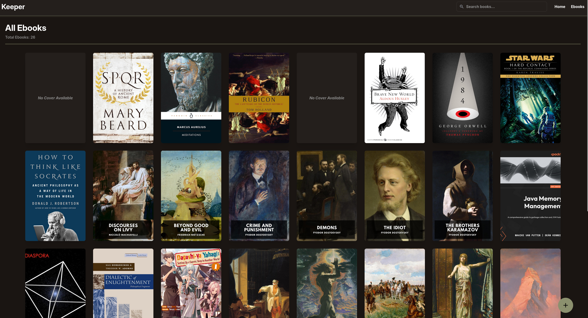
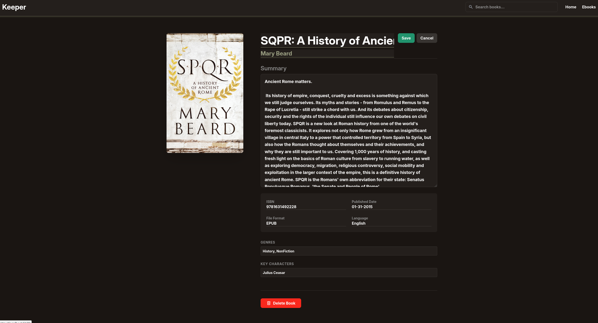

# Keeper - An Ebook Collection Tracker

---

# Overview
An ebook tracker that allows users to add, update and delete ebooks from their personal collections. 

## Features
- Books can be sorted by Genre
- Edit and delete books from one screen.
- Characters have personal pages

---

# Visuals

# Todo
- [ ] Add a page that gives a 404 error page if it does not exist. Happened to me when I clicked a book.
- [ ] Make it so when a user searches it returns three different sections: Books, Authors, Characters. If there is no element in 2/3 of the sections, just return the one section